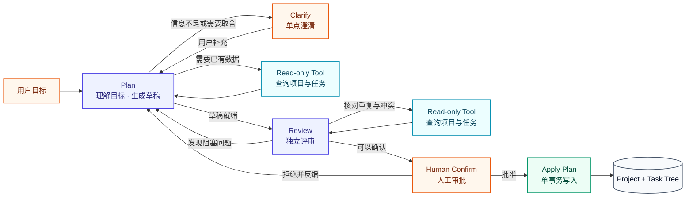
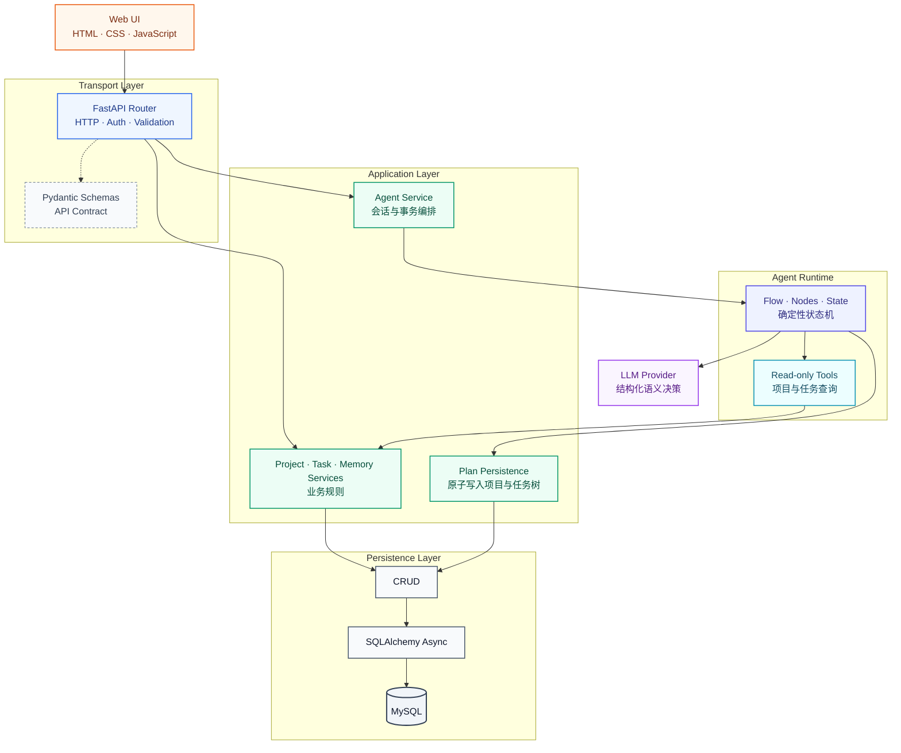

# Task Manager：智能任务规划系统

一个由 Agent 驱动的任务规划与管理系统。

用户可以用自然语言描述一个明确或模糊的目标，系统会经过需求澄清、结构化规划、工具查询、计划评审和人工确认，最终把通过审核的计划保存为项目与任务树。计划保存后，用户可以继续维护任务状态并跟踪完成进度。

项目聚焦于“从自然语言目标到可追踪计划”的规划闭环，而不是只生成一段静态待办文本。

## 当前能力

- 使用自然语言创建并持续完善计划。
- 在信息不足、目标冲突或约束不可满足时向用户澄清。
- 将目标、约束、验收标准、项目和任务树转换为结构化数据。
- 调用只读工具查询用户已有项目和任务，辅助发现重复或冲突。
- 在计划完成后自动进入独立的 Review 阶段，检查完整性、可行性、时间安排、重复和冲突。
- 在计划真正写入数据库前设置人工确认边界（Human-in-the-loop）。
- 用户确认后，在同一事务中创建项目和递归任务树。
- 通过项目和任务接口维护状态、优先级、层级关系与归档状态。
- 支持对话上下文压缩，以及经过人工确认的长期记忆。
- 支持 Agent 会话持久化与恢复，降低长请求断开后前后端状态不一致的影响。
- 提供确定性测试和基于真实模型的 Agent Eval。

## Agent 工作流



工作流由确定性状态机控制，LLM 只负责需要语义判断的节点。节点输出必须通过 Pydantic Schema 校验，工具调用、状态转换和人工审批边界由代码约束。

## 设计重点

### 1. 规划与评审分离

Plan 负责理解目标并生成计划，Review 使用独立提示词和结构化返回类型检查计划。评审结论只能是继续评审、重新规划或进入人工确认，存在阻塞性问题时不能直接通过。

### 2. 结构化输出与容错

模型通过 OpenAI 兼容接口返回 JSON，由 Pydantic 执行二次校验。遇到格式错误时，Provider 会携带精简的校验错误进行一次纠正重试，避免把模型生成的非标准 JSON 直接传入业务流程。

### 3. 工具调用有明确边界

Agent 当前可以调用以下只读工具：

- 查询当前用户的项目列表；
- 查询指定项目的任务树。

工具数据按当前用户隔离，用于识别已有计划、重复任务和潜在冲突。写操作不会由规划或评审节点直接执行。

### 4. 人工确认与原子落库

计划必须经过人工确认才能写入业务表。批准后，项目和全部任务在同一个数据库事务中创建；任意一步失败都会回滚，避免只创建项目或只写入部分任务。重复批准已完成会话时会返回已有结果，避免重复落库。

### 5. 两层记忆

- **对话摘要**：压缩较早的会话内容，控制上下文长度，同时保留目标、约束和关键决策。
- **长期记忆**：保存用户偏好、约束、资料和长期目标。手动录入的自然语言会先由 LLM 提取并决定创建、更新或忽略；从对话中提取的记忆先进入待确认状态，只有用户批准后才会参与后续规划。

长期记忆作为每轮规划时的检索上下文加载，不复制进 Agent State，避免状态持续膨胀并保持数据来源单一。

### 6. 会话恢复

Agent 会话状态持久化在数据库中。前端保存会话标识，并可通过会话查询接口恢复最新阶段；当长请求发生超时、网络中断或状态冲突时，前端会重新同步服务端状态，避免继续调用已经不适用于当前阶段的接口。

## 技术架构

后端按照传输层、应用层、Agent Runtime 和持久化层拆分：



主要技术栈：

- Python 3.12+
- FastAPI
- Pydantic
- SQLAlchemy Async + aiomysql
- MySQL
- Alembic
- OpenAI 兼容的 Chat Completions API
- pytest
- uv
- 原生 HTML、CSS 和 JavaScript

## 项目结构

```text
task_manager/
├── agent/          # Prompt、Provider、Runtime Flow、工具与记忆
├── alembic/        # 数据库迁移
├── core/           # 配置、安全与日志
├── crud/           # 数据访问层
├── database/       # Engine、Session 与 Base
├── dependencies/   # FastAPI 依赖
├── evals/          # Agent 评估数据集、评分器与运行器
├── exceptions/     # 领域异常与异常处理
├── frontend/       # 原生前端与本地反向代理
├── models/         # SQLAlchemy 模型
├── router/         # HTTP 路由
├── schemas/        # API 与业务数据模型
├── services/       # 业务逻辑、事务编排与计划落库
├── tests/          # 确定性测试
├── main.py         # FastAPI 应用入口
└── pyproject.toml  # 项目依赖与 Python 配置
```

## 快速开始

### 1. 环境要求

- Python 3.12 或更高版本
- [uv](https://docs.astral.sh/uv/)
- 可访问的 MySQL 数据库（本地启动时）
- Docker 与 Docker Compose（整套容器启动时）
- 支持 OpenAI 兼容接口和 JSON 输出的模型服务

### 2. 安装依赖

在项目根目录运行：

```bash
uv sync
```

### 3. 创建数据库

下面以本地数据库名 `task_manager` 为例：

```sql
CREATE DATABASE task_manager
    CHARACTER SET utf8mb4
    COLLATE utf8mb4_unicode_ci;
```

### 4. 配置环境变量

复制环境变量模板：

```bash
test -f .env || cp .env.example .env
```

编辑 `.env`，替换数据库密码、`SECRET_KEY` 和模型配置。如果已有 `.env`，请对照 `.env.example` 补充 `MYSQL_*` 变量。不要把真实密钥提交到 Git。密码可使用以下命令生成：

```bash
openssl rand -hex 32
```

### 5. 执行数据库迁移

```bash
uv run alembic upgrade head
```

### 6. 启动后端

```bash
uv run fastapi dev main.py
```

启动后可访问：

- OpenAPI 文档：<http://127.0.0.1:8000/docs>
- ReDoc：<http://127.0.0.1:8000/redoc>

### 7. 使用 Docker 一键启动整套系统（可选）

使用 Docker 时只需先完成第 4 步，无需在宿主机安装 Python、uv 或 MySQL，也无需手动执行迁移、启动后端和前端。

```bash
docker compose up --build
```

该命令会自动启动 MySQL、执行 Alembic 迁移、启动后端和前端。启动完成后访问 <http://127.0.0.1:5173>，API 文档位于 <http://127.0.0.1:8000/docs>。按 `Ctrl+C` 停止后可清理容器：

```bash
docker compose down
```

MySQL 数据保存在 Docker volume 中，`docker compose down` 不会删除数据。

### 8. 启动前端

在另一个终端中运行：

```bash
uv run python frontend/server.py
```

然后访问 <http://127.0.0.1:5173>。

如果后端不在默认地址，可以显式指定：

```bash
uv run python frontend/server.py \
  --api-url http://127.0.0.1:8000 \
  --port 5173
```

`frontend/server.py` 只是本地开发使用的静态文件服务器和 API 代理，不是生产环境部署服务器。

## API 概览

完整请求与响应格式以启动后的 OpenAPI 文档为准。

| 模块 | 路径前缀 | 作用 |
| --- | --- | --- |
| 认证 | `/api/auth` | 注册、登录、刷新令牌和退出 |
| 用户 | `/api/user` | 查询和更新当前用户 |
| 项目 | `/api/projects` | 项目创建、查询、更新、归档与恢复 |
| 任务 | `/api/tasks` | 任务树管理、状态更新、归档与恢复 |
| Agent | `/api/agent` | 创建会话、继续会话、恢复状态和人工确认 |
| 记忆 | `/api/memories` | 长期记忆提取、查询、确认、编辑和归档 |

## 测试

### 确定性测试

```bash
uv run pytest
```

当前版本的本地基线为 **132 项测试通过**。这些测试覆盖核心 Service、Agent 节点与状态转换、路由契约、记忆处理、计划落库事务、会话恢复和 Workflow Eval 运行器等路径，不会调用真实 LLM。

### Agent Eval

Eval 会调用 `.env` 中配置的真实模型，可能产生 API 费用：

```bash
# 单节点行为：Plan / Review
uv run python -m evals.node_runner

# 完整工作流：Clarify / Tool / Replan / Confirm
uv run python -m evals.workflow_runner
```

两个入口彼此独立，可以只跑当前修改涉及的一层。也可以指定用例并重复执行，
用于观察模型行为稳定性：

```bash
uv run python -m evals.node_runner \
  --case plan_complete_goal_builds_draft \
  --repetitions 3

uv run python -m evals.workflow_runner \
  --case blocking_review_replans_then_confirms \
  --repetitions 3
```

当前保留的一次完整 Node 本地基线结果：

| 指标 | 结果 |
| --- | ---: |
| Eval Suite | `core-agent-nodes v1.4` |
| 模型 | `deepseek-v4-flash` |
| 用例通过率 | 13 / 13（100%） |
| 结构化输出 | 13 / 13（100%） |
| 硬性指标 | 全部通过 |
| 平均延迟 | 10,602 ms |
| P50 / P95 延迟 | 8,655 ms / 23,575 ms |

该结果是 2026-07-13 在单一模型上的 Node Eval 基线，不代表任意模型或任意输入都能达到相同效果。当前 Eval 采用代码评分器而不是 LLM-as-a-Judge，便于得到可复现、可解释的回归信号；Workflow Eval 暂未记录真实模型基线，数据集也仍较小，后续需要继续补充真实失败样本、多模型对比和重复运行。

评估设计和用例格式详见 [evals/README.md](evals/README.md)。

## 关键工程取舍

- **确定性流程包围非确定性模型**：状态转换、权限、事务和写操作由代码控制，LLM 只负责语义决策。
- **先使用只读工具**：规划阶段不直接修改业务数据，降低模型误操作风险。
- **人工确认后再写入**：把不可逆或高影响操作放在明确的审批边界之后。
- **记忆需要治理**：对话提取的长期记忆先由用户确认，避免错误信息静默污染未来上下文。
- **先完成单 Agent 规划闭环**：当前没有引入多 Agent 编排，优先保证流程可验证、错误可定位。
- **Eval 与单元测试分离**：pytest 检查确定性代码，Eval 检查模型在代表性场景中的行为。

## 当前限制

- 已建立会话可以在长请求失败后恢复；如果首次创建会话的请求在前端收到会话标识之前断开，前端仍无法自动定位该会话。
- Eval 数据集目前包含 13 个 Node 用例和 3 个 Workflow 用例，尚未覆盖更长对话、更多异常工具返回、Prompt Injection 和跨模型稳定性。
- 当前只有基础日志和错误记录，尚未提供完整的 Trace、Token 成本统计和生产级可观测性。
- 已支持本地 Docker Compose，但尚未接入持续集成、远程部署和生产环境配置。

## 后续计划

1. 扩充 Eval 数据集，加入真实失败样本、多轮场景、重复运行和多模型对比。
2. 增加完整 Trace、模型延迟、Token 用量和单次规划成本统计。
3. 为工具增加超时、重试和更细粒度的错误恢复策略。
4. 补充持续集成、远程部署说明与生产环境安全配置。
5. 增加 Agent 安全测试，包括越权工具调用和 Prompt Injection 防护。

## 版权声明

Copyright © 2026. 保留所有权利。

本仓库公开仅用于个人作品展示、技术交流和招聘评审，不代表授予任何开源软件许可。除法律规定或代码托管平台服务条款另有允许外，未经版权所有者明确书面许可，不得复制、修改、分发、再许可或用于商业用途。

本项目使用或引用的第三方软件及资源不属于上述声明的授权范围，分别适用其各自的许可证和版权条款。
